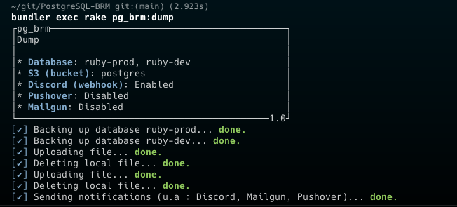
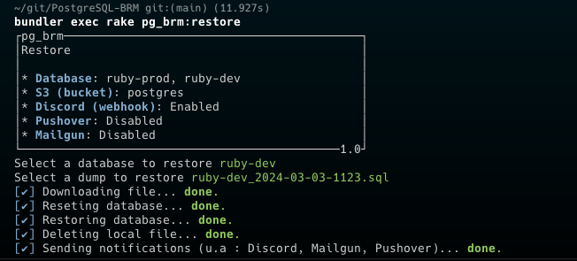

# PostgreSQL BRM

A Ruby-Based PostgreSQL Backup and Restore Manager designed to enable you to securely store your database dumps in an S3 Bucket, while also providing notifications via Discord Webhooks, Pushover, and Mailgun.





## Docker

The PostgreSQL BRM is also available as a Docker image. The image will be periodically dump the database and store the dump in an S3 bucket (if configured). 

```yaml
---
version: "3.8"

services:
    postgres:
        image: docker.io/postgres:16-alpine
        restart: unless-stopped
        networks:
        - db
        volumes:
        - ./db/:/var/lib/postgresql/data:Z
        environment:
        - POSTGRES_DB: "db"
        - POSTGRES_USER: "user"
        - POSTGRES_PASSWORD: "password"
        labels:
        - io.containers.autoupdate=registry

    pg_brm:
        image: ghcr.io/lukasw01/postgresql_brm:latest
        container_name: pg_brm
        restart: unless-stopped
        networks:
        - db
        volumes:
        - ./env.yaml:/ruby/env.yaml:Z
        - ./backup/:/ruby/lib/backup:Z
        - ./log/:/ruby/lib/log:Z
        environment:
        - TZ=Europe/Zurich # default
        - SCHEDULE=0 0 * * * # default (no @daily support)
        labels:
        - io.containers.autoupdate=registry

networks:
  db:
    external: true
```

## Getting Started

Install the dependencies:

```bash
bundle install
```

Create a `env.yaml` file and fill in the required environment variables. You can use the [env.example.yaml](https://gitlab.com/LukasW01/postgresql-brm/-/blob/main/env.yaml.example) as a template.


Expecuted the following rake-tasks to dump and restore the database:

```bash
# dump the database
bundle exec rake pg_brm:dump

# restore the database
bundle exec rake pg_brm:restore
```

## License

This program is licensed under the MIT-License. See the "LICENSE" file for more information